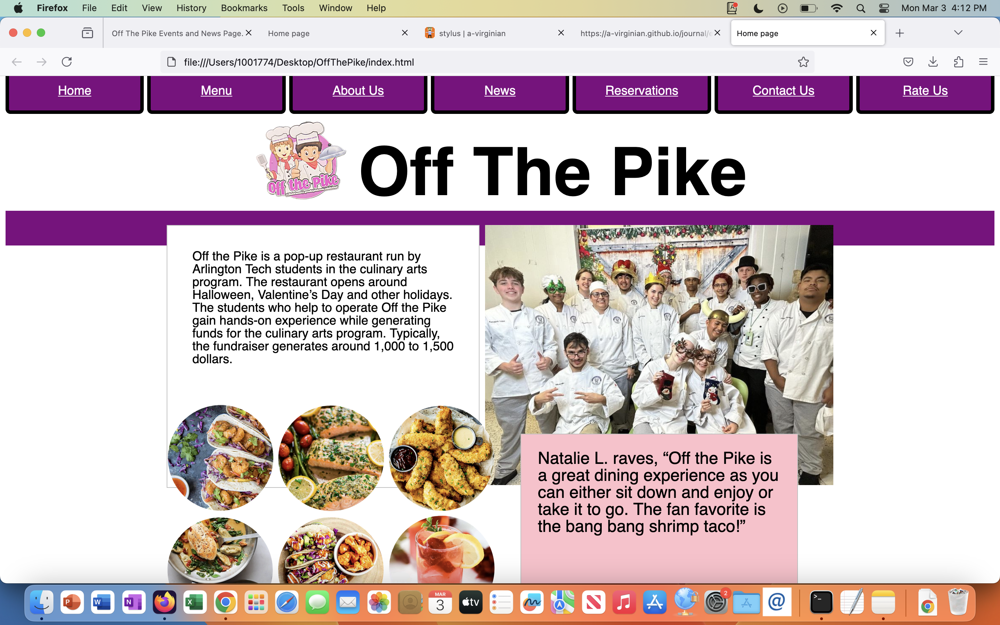
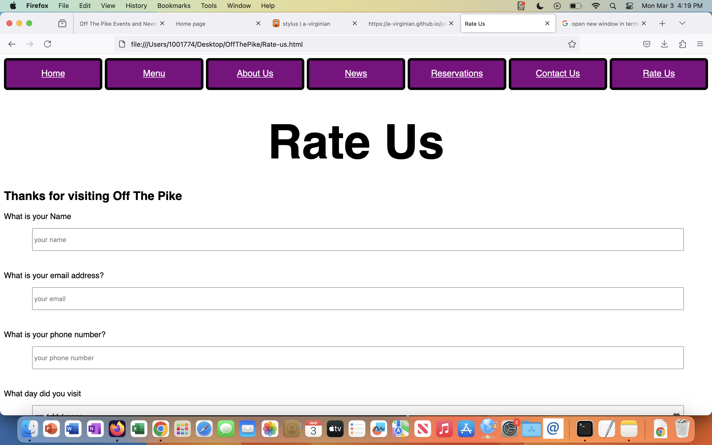

# stylus
link to webstite 
[website](https://notabotdaniel.github.io/OffThePike/)
i cant get the link to the website working so here is the link written out https://notabotdaniel.github.io/OffThePike/

link to repo
[repo](https://github.com/NotABotDaniel/OffThePike)

my form is the rate us page i have several types of inputs such as number, tel, email, date and text. and the request method is post. 

overall working with others pulling, shareing and merging went good however one or two times i had to fix a merge conflict which was confusinng  
